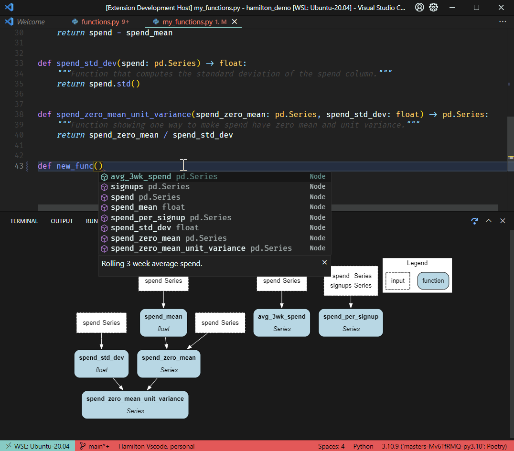

# Hamilton - VSCode extension (unofficial)

## Get started
Go through the VSCode walkthrough by viewing the command pallet (`ctrl+p`) and using command `Welcome: Open Walkthrough...`

## Features
- Interactive dataflow visualization
- Completion suggestions for dataflow definitions

## Installation
- Install from VSCode marketplace [link](https://marketplace.visualstudio.com/items?itemName=ThierryJean.hamilton)
