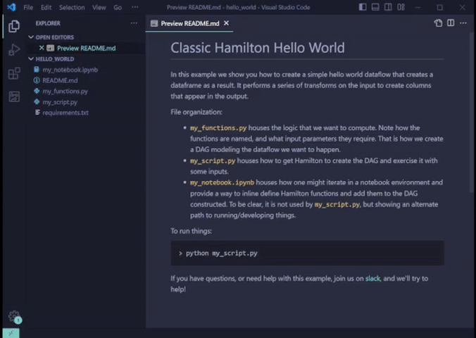

# Hamilton - VSCode extension (unofficial)

## Features
- Sidebar tree view UI:
  - Nested Python modules => Python functions (ignore names with underscore prefix)
  - Icons for modules and functions
  - Click item to open in editor tab
  - Tree view auto-refreshes on file updates
  - Buttons to execute "Refresh", "Select", and "Build DAG" commands
- Commands:
  - Manually refresh Tree view (shouldn't be needed)
  - Select Python modules
  - Build full DAG and output visualization for selected Python modules
- Cache:
  - Caches Python module selection to workspace for future command call
- Workspace:
  - Automatically uses Python interpreter selected for the workspace
- Packaged with the extension the script `vscode.py` to execute the Hamilton DAG

## Installation
- Install from VSCode marketplace [link](https://marketplace.visualstudio.com/items?itemName=ThierryJean.hamilton)

## Known bugs
- When reloading / reopening a workspace, modules need to be unregistered then registered again to display properly. Apparently, it is due to the command `vscode.executeDocumentSymbolProvider` in `moduleProvider.ts` trying to access a `DocumentSymbolProvider` at startup before it becomes available.

## TODO
- Implement vscode.TaskProvider or shell child processes to call Hamilton and handle output
- Pass Hamilton execution and visualization configuration  from VSCode
- Allow to select individual functions from module to build graph
- Provide language support to write Hamilton Python functions

## References
- Webview with React [link](https://github.com/microsoft/vscode-webview-ui-toolkit/blob/main/docs/getting-started.md)
- Programmatically access Theme [link](https://www.eliostruyf.com/code-driven-approach-theme-vscode-webview/)