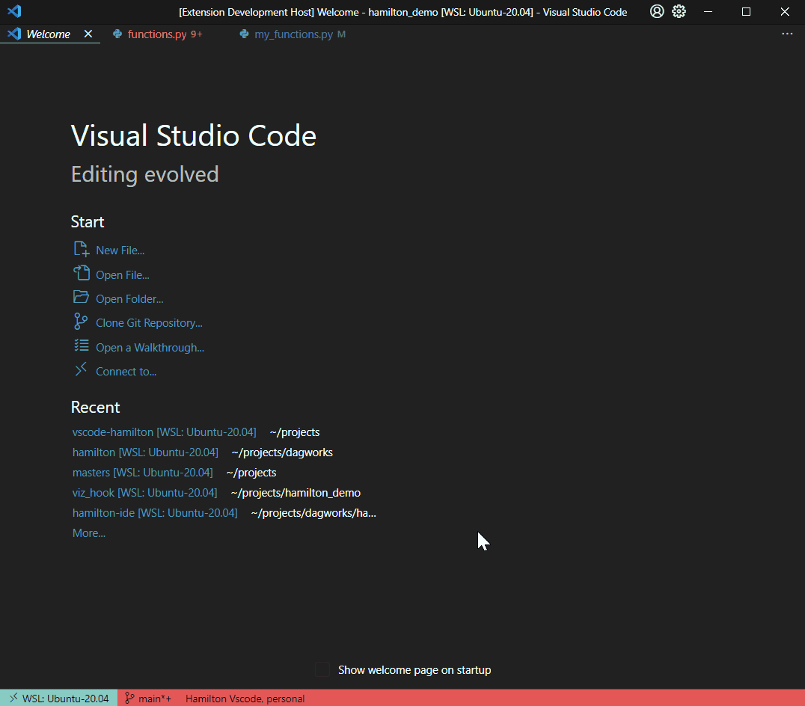

# Hamilton - VSCode extension (unofficial)

## Features
- Interactive DAG viewers
- Real-time DAG validation with a WebSocket Hamilton server
- Sidebar to navigate module functions

## Installation
- Install from VSCode marketplace [link](https://marketplace.visualstudio.com/items?itemName=ThierryJean.hamilton)

## TODO
- Allow to select individual functions from module to build graph
- Provide language support to write Hamilton Python functions
